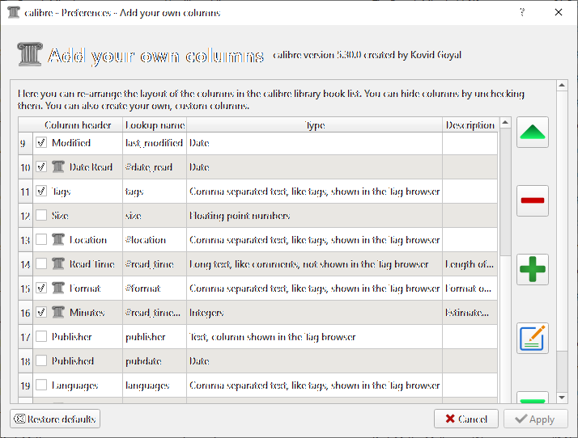
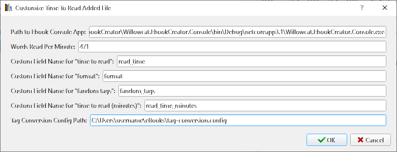

# Willowcat.EbookCreator

.NET Standard Library for building epub files to use with e-readers. 

Includes a command line tool that can estimate how long it would take
to read an epub file and a couple [Calibre](https://calibre-ebook.com/) plugins to automatically include 
a "Time to Read" field when adding a book to Calibre. 

## Dependencies

* .NET Standard 2.0 or higher
* (For the console program) .NET Core 3.1 or higher
* (For the plugins) Calibre 5.00 or higher

## Installing Calibre Plugins

AddBookPlugin will set the Time To Read on newly created ebooks if they are in epub format and are not encrypted. It will also check if the books are from Archive of Our Own, and parse tags and set the format accordingly.

UpdateBookPlugin will update the Time To Read on selected books. This is useful if the epub document was edited (ie, html files removed or added), or if the Words Per Minute setting was adjusted.

1. Navigate to the plug-in folders and run `calibre-customize`.
```
> cd Willowcat.EbookCreator.Console\CalibrePlugins\AddBookPlugin
> calibre-customize -b
```

2. Add custom fields for the plug-ins to use.
    - "time to read" - long text; stores the time to read as a number of asterisks (*) plus a formatted hour/minute string. Meant as a visual representation.
    - "time to read (minutes)" - integers; stores the time to read as minutes. Meant for for sorting and querying the read time.
    - "fandom tags" - used to store the tags parsed from Archive of Our Own ebooks. A separate configuration file is used to determine how to parse the tags.
    - "format" - if the ebook is identified as an Archive of Our Own ebook, this field will be set to "Fan Fiction"
    

3. (optional) Create a Tag Conversion configuration.

    Tags are defined by `parsedTag = newTag`. The `newTag` value is optional, but the `=` is required for the parser to recognize the line as a tag line.
    Tags can be under the header `[REMOVE]` or `[CONVERT]`. Tags in `[REMOVE]` are ignored and not added to the "fandom tags" field. Tags in `[CONVERT]` are renamed to the `newTag` value. Tags that contain the pattern "alternative universe - {x}" are renamed to "AU.{x}" All other tags are added as is.
    ```
    [REMOVE]
    gen = 
    choose not to use warnings = 

    [CONVERT]
    humor = Tone.Humor
    mystery = Genre.Mystery
    ```

4. Customize the plug-in settings
    - "Path to Ebook Console App" - the path where the console app can be found.
    - "Words Read Per Minute" - how many words can be read in a minute. Many eReaders can provide this information; I use MoonReader
    - "Custom Field Names..." - set using the "lookup name" without `#` of the custom field.
    - "Tag Conversion Config Path" - the path where the configuration for parsing tags can be found.
    

5. Use the plugins! The AddBookPlugin will be used when adding a new ebook to Calibre. By default, the UpdateBookPlugin will be used on selected ebooks when pressing `CTRL+R`.

See [Creating Plugins](https://manual.calibre-ebook.com/creating_plugins.html#id13) for more details on debugging and customizing plugins for Calibre.

## Creating eBooks from HTML files


```csharp

// the data to use to build the epub file
var bookItemData = new BookModel() 
{
    Bibliography = new BibliographyModel() 
    {
        // all kinds of metadata useful for a book
    },

    // if set, will include a custom calibre metadata element for "#read_times"
    // in the generated epub file
    WordsReadPerMinute = 471
};

// The html files that will be read. 
// Add them to the list in the preferred reading order.
bookItemData.TableOfContents.ChapterFiles.AddRange(new List<FileItemModel>());

// Other files that are referenced in the epub, such as images or stylesheets
bookItemData.TableOfContents.OtherFiles.AddRange(new List<FileItemModel>());

// These entries are used to build the Table of Contents file and should reference
// the chapter files above. Usually one per chapter file.
bookItemData.TableOfContents.Entries.AddRange(new List<TableOfContentsLinkModel>());

// Used for as a staging ground to create the files that
// will eventually be zipped into the epub file
var stagingDirectory = @"D:\Users\user\Documents\eBooks\bookTitle\epub",

// The directory to create the create the merged epub file at.
var epubFilePath = @"D:\Users\user\Documents\eBooks\bookTitle"

var epubBuilder = new EpubBuilder();
epubBuilder.Create(bookItemData, stagingDirectory, epubFilePath)
```

## Merging epub files

The `MergeBooksPublicationEngine` merges works from an [AO3](https://archiveofourown.org) 
series list into a single epub document. A subset or custom order of works
can also be specified.


```csharp

var series = new SeriesModel()
{
    // optional, will automatically download the requested works 
    // from the url if included. otherwise will use the epubs already
    // in the ?? directory.
    // should be in the format https://archiveofourown.org/series/\d+
    SeriesUrl = "{seriesUrl}",

    // optional, the work indexes to include; 1-based, see the SeriesUrl for the value.
    // if null, then all the works in the series will be included in their 
    // default index order.
    WorkIndexes = new int[] { 3, 2, 6, 7 },

    // optional, use to specify the name of the series to include in the metadata
    SeriesName = "{seriesTitle}", 

    // optional, use to specify the series index to include in the metadata
    SeriesIndex = 2
};

var options = new EpubOptions()
{
    // if false, the engine won't re-download the files if they have 
    // been downloaded already
    OverwriteOriginalFiles = true, 

    // if set, will include a custom calibre metadata element for "#read_times"
    // in the generated epub file
    WordsReadPerMinute = 471
};

var filePaths = new EpubFilePaths()
{
    // The directory where the original book files are. 
    // In this case, the location where AO3 epub files are be 
    // downloaded to.
    // NOTE! the files will be added to the merged epub in 
    // alphabetical order of their file names
    SourceDirectory = @"D:\Users\user\Documents\eBooks\bookTitle\original",
    
    // Used for as a staging ground to create the files that
    // will eventually be zipped into the epub file
    StagingDirectory = @"D:\Users\user\Documents\eBooks\bookTitle\epub",

    // The directory to create the create the merged epub file at.
    EpubFilePath = @"D:\Users\user\Documents\eBooks\bookTitle"
};

var epubBuilder = new EpubBuilder();
var engine = new MergeBooksPublicationEngine(epubBuilder, options);

await publicationEngine.PublishAsync(series, filePaths);
```